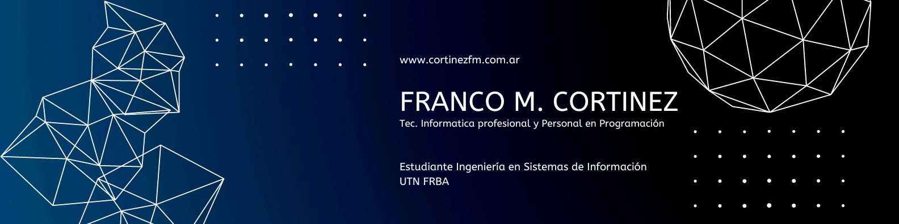

# ¡Hola! Soy Franco Matías Cortinez 👋

## 🔎 Sobre mí

Soy Técnico en Informática Profesional y Personal en Programación, actualmente cursando la carrera de Ingeniería en Sistemas de Información en la Universidad Tecnológica Nacional - Facultad Regional Buenos Aires (UTN FRBA). Me apasiona la docencia y la investigación en el campo de la tecnología. Como docente, enseño Programación, Algoritmos y Estructura de Datos, y Tecnología de la Información y Comunicación (TICS). Disfruto motivando a mis estudiantes a desarrollar proyectos innovadores y explorar el vasto mundo de la tecnología.

Además, soy Ayudante de Cátedra en la asignatura Sistemas y Procesos de Negocios de la misma universidad. Me estoy formando como Investigador, con un fuerte interés en descubrir y desarrollar tecnologías evolutivas que puedan transformar el futuro.

## 🔎 Acerca de mí

- 👨‍🏫 Docente dedicado: Enseño Programación, Algoritmos y Estructura de Datos, y Tecnología de la Información y Comunicación (TICS)
- 👨‍🎓 Estudiante: Cursando Ingeniería en Sistemas de Información en UTN FRBA
- 🕵️‍♂️ Explorador de tecnologías emergentes: Apasionado por la investigación y el desarrollo de soluciones innovadoras
- 👨‍🏫 Ayudante de Cátedra: Colaboro en la asignatura Sistemas y Procesos de Negocios de la carrera Ingeniería en Sistemas de Información en UTN FRBA
- 🧩 Trabajo en equipo: Firme creyente de que juntos, somos más que la suma de nuestras partes 👩🏻👨🏾👨🏻‍🦰👩🏽‍🦱

## 💻 Mis Lenguajes de Programación

      

## 🚀 Mis Proyectos

En este repositorio, puedes encontrar una colección de proyectos que he realizado tanto de forma individual como colaborativa, en diversas áreas como Inteligencia Artificial, Robótica, y más. Estos proyectos reflejan mi interés en el desarrollo de soluciones innovadoras y en la integración de nuevas tecnologías. [Visita mi repositorio de proyectos](https://github.com/Zenitroc/Proyectos)

## 📫 Contacto

Si tienes alguna pregunta o simplemente deseas conectarte, no dudes en contactarme:

- **Email:** [francortidf@gmail.com](mailto:francortidf@gmail.com)
- **LinkedIn:** [Franco Matías Cortinez](https://www.linkedin.com/in/francocortinez/)

---

¡Gracias por visitar mi portfolio! Estoy siempre abierto a nuevas colaboraciones y oportunidades. ¡No dudes en ponerte en contacto conmigo!
